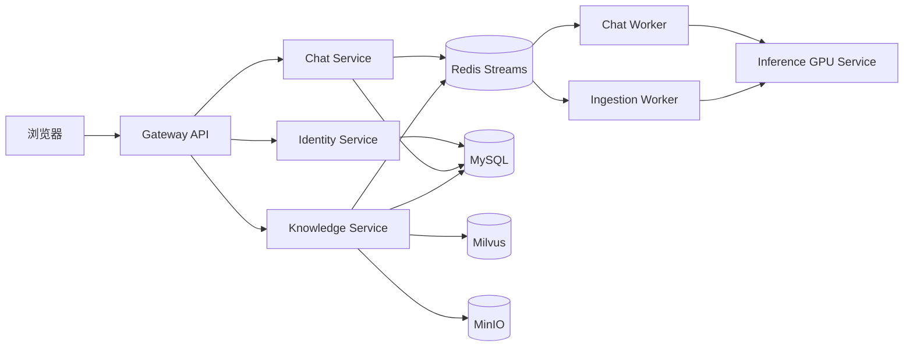

# EvidenceRAG

[](https://www.python.org/)
[](https://fastapi.tiangolo.com/)
[](https://docs.docker.com/compose/)
[](LICENSE)

EvidenceRAG 是一个面向企业知识问答的开源 RAG 系统。它将文档解析、混合检索、重排、证据引用、身份权限和运行监控拆分为可独立扩展的服务，让回答可以追溯到具体文档、章节、页码和版本。

项目默认以微服务方式运行，并保留原有单体实现用于迁移验证和兼容性回归。

## 功能

- 支持 PDF、Word、Markdown、HTML、TXT、Excel 和统一 JSON 文档。
- 保留标题、章节、页码、表格行号等结构信息，并使用父子分块组织知识。
- 使用 BGE-M3 Dense 向量与 Milvus BM25 混合召回，再通过交叉编码器重排。
- 回答携带来源、版本、章节、页码、检索分数和重排分数；证据不足时明确返回知识不足。
- 提供员工账号申请、管理员审核、单账号唯一在线会话、角色权限和管理审计。
- 管理后台包含文档管理、用户问答实时反馈和 Token 用量告警。
- 通过 Redis Streams 执行异步入库和回答任务，并支持失败重试与死信处理。
- 将 GPU 推理与业务 API 隔离，便于独立扩缩容。

## 架构



| 组件 | 职责 |
| --- | --- |
| Gateway | 统一入口、页面托管、会话校验和服务路由 |
| Identity | 用户、账号申请、权限、管理员操作和审计 |
| Chat | 会话、问答任务、反馈、Token 统计与告警 |
| Knowledge | 文档上传、解析、入库、版本和检索 |
| Inference | Embedding、Reranker 和生成模型适配 |
| Redis / MySQL / Milvus / MinIO | 队列、事务数据、向量与对象存储 |

更完整的服务边界和数据流见[微服务改造方案](docs/MICROSERVICES_MIGRATION_PLAN.md)与[架构说明](docs/ARCHITECTURE.md)。

## 快速开始

### 前置条件

- Python 3.11 或更高版本
- Docker Engine 与 Docker Compose v2
- 可用的 NVIDIA GPU 和 NVIDIA Container Toolkit
- 本地 BGE-M3、BGE Reranker 模型目录
- DeepSeek 兼容 API Key

模型文件、真实业务文档、数据库卷和密钥不会提交到仓库，请按对应模型的许可证自行下载和使用。

### Windows PowerShell

```powershell
git clone https://github.com/207721zzl/new.git
Set-Location new

Copy-Item .env.example .env
python -m venv .venv
.\.venv\Scripts\python.exe -m pip install python-dotenv

# 编辑 .env，至少配置 DEEPSEEK_API_KEY、BGE_M3_HOST_PATH、RERANKER_HOST_PATH。
# Windows 路径建议写成 D:/models/bge-m3 这样的形式。

.\.venv\Scripts\python.exe -m scripts.init_microservices
.\scripts\start_microservices.ps1 -Build
```

### Linux / macOS

```bash
git clone https://github.com/207721zzl/new.git
cd new

cp .env.example .env
python3 -m venv .venv
.venv/bin/python -m pip install python-dotenv
.venv/bin/python -m scripts.init_microservices

# 编辑 .env 后启动服务。
docker compose \
  --env-file .env \
  --env-file .env.microservices \
  -f deploy/compose.yml \
  up -d --build
```

启动完成后访问：

- 登录页：<http://127.0.0.1:18000/login>
- 员工问答：<http://127.0.0.1:18000/>
- 管理后台：<http://127.0.0.1:18000/admin>
- 健康检查：<http://127.0.0.1:18000/api/v1/health/ready>

首次启动后，在终端中创建第一个管理员：

```powershell
docker compose `
  --env-file .env `
  --env-file .env.microservices `
  -f deploy/compose.yml `
  exec identity python -m services.identity.create_admin `
  --username admin --display-name "系统管理员"
```

命令会交互式读取密码，不会把密码写入命令历史。

## 局域网与临时公网访问

Windows 环境可以使用以下脚本：

```powershell
# 监听局域网地址；脚本会校验运行数据位于 D 盘。
.\scripts\start_lan_microservices.ps1 -Build

# 在局域网服务之上创建 Cloudflare Quick Tunnel 临时 HTTPS 地址。
.\scripts\start_public_microservices.ps1 -Build
```

Quick Tunnel 适合演示和临时验收，地址会在进程重启后变化。长期公网运行请配置自己的域名、持久 Cloudflare Tunnel 或反向代理，并启用 HTTPS、访问控制和备份策略。

详细操作见[微服务运行手册](docs/MICROSERVICES_RUNBOOK.md)和[试点运行手册](docs/PILOT_RUNBOOK.md)。

## 本地开发与验证

```powershell
python -m venv .venv
.\.venv\Scripts\python.exe -m pip install -r requirements.txt
.\.venv\Scripts\python.exe -m pytest -q
.\.venv\Scripts\python.exe -m ruff check app services tests_rag tests_microservices
```

提交改动前还可以验证 Compose 配置：

```powershell
docker compose `
  --env-file .env `
  --env-file .env.microservices `
  -f deploy/compose.yml `
  config --quiet
```

## 目录结构

```text
app/                    共享领域代码与兼容单体入口
services/               Gateway、Identity、Chat、Knowledge、Inference 服务
deploy/                 Docker Compose、Dockerfile 和运行配置
alembic_*/              各服务独立数据库迁移
scripts/                初始化、启动、迁移、评测与运维脚本
frontend/               登录、问答和管理后台页面
tests_rag/              RAG 核心测试
tests_microservices/    微服务契约、队列与数据边界测试
docs/                   架构、迁移和运行文档
```

旧版单体部署说明见 [LEGACY.md](LEGACY.md)。

## 安全与数据

- 不要提交 `.env`、API Key、Cookie 密钥、模型权重或真实业务文档。
- 首次部署请替换示例数据库密码，并使用 `scripts.init_microservices` 生成服务间密钥。
- 上传文件、数据库卷、模型与运行日志默认属于本地数据，不纳入版本控制。
- 发现安全问题请按 [SECURITY.md](SECURITY.md) 私下报告。

## 参与贡献

欢迎提交问题、改进文档和代码。开始前请阅读 [CONTRIBUTING.md](CONTRIBUTING.md) 与 [CODE_OF_CONDUCT.md](CODE_OF_CONDUCT.md)。

## 许可证

本项目采用 [MIT License](LICENSE)。
