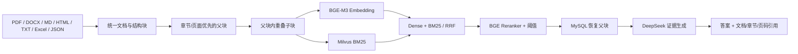

# EvidenceRAG

一个专注于企业文档知识问答的完整 RAG 项目：直接上传 PDF、Word、Markdown、HTML、TXT、Excel 或统一 JSON，系统完成结构化解析、父子切块、Dense + BM25 混合检索、Reranker、父块恢复、证据门控和带引用回答。

项目由原有经营分析 Agent 收敛而来；在线入口现在只保留 RAG，不再路由到 Text2SQL、经营归因、销量预测或 MCP。

## 当前运行形态

- 默认使用 Docker Compose 启动 `api`、`mysql`、`standalone`（Milvus）、`etcd`、`minio` 和 `tunnel` 六个服务。
- API 镜像基于 PyTorch CUDA Runtime，Compose 通过 `gpus: all` 使用 NVIDIA GPU。
- BGE-M3 与 `bge-reranker-v2-m3` 不复制进镜像，而是从宿主机目录只读挂载到容器。
- 本机入口固定为 `http://127.0.0.1:8000/`；`cloudflared` 提供可选的临时公网 HTTPS 入口，不开放路由器入站端口。
- 公网与本机入口均使用服务端会话认证；注册账号需要管理员审批，普通员工与管理员按角色授权。
- 每个问答会话都绑定创建用户，列表、详情、运行状态、事件流和反馈均执行所有权校验。
- 知识片段数量是运行数据，不是固定配置。管理员可在 `/admin` 查看、上传和删除知识文档。

## 完整链路



查询侧在检索前还会结合最近会话，把“那它呢”一类问题补成独立问题，并生成适合 Dense 和 BM25 的检索表达。无命中或重排分数低于门槛时直接拒答，不调用生成模型。

## 支持格式

| 格式 | 解析方式 | 保留结构 |
|---|---|---|
| PDF | PyMuPDF；无文本页可选 Tesseract OCR | 页码、文本块、OCR 标记 |
| Word `.docx` | python-docx | 标题层级、段落、表格 |
| Markdown | 内置解析器 | 标题路径、正文、表格、代码块 |
| HTML | BeautifulSoup | 标题路径、段落、列表、表格、代码 |
| TXT | UTF-8/GB18030 自动尝试 | 段落 |
| Excel | openpyxl；旧 `.xls` 使用 pandas/xlrd | 工作表、表格、行号 |
| JSON | Pydantic 严格校验 | 兼容原 JSON，亦可携带通用元数据 |

统一文档保存 `document_id`、`title`、`content`、`doc_type`、`source`、`version`、`updated_at`、`original_filename`、`mime_type`、`content_sha256`、`language`、`metadata`。解析阶段的结构块额外包含 `block_type`、`section_path`、`page_start/page_end`、`row_start/row_end`。

父块保存在 MySQL，保留完整上下文和定位元数据；子块写入 Milvus，包含 `chunk_id`、`parent_chunk_id` 和同源元数据。子块负责召回，命中后按 `parent_chunk_id` 恢复父块生成，因此既兼顾召回精度，也避免只把零碎句子交给大模型。

## Docker 启动

要求 Docker Desktop、可用的 NVIDIA 容器运行环境，以及本地 BGE-M3、`bge-reranker-v2-m3` 模型目录。首次部署：

```powershell
Copy-Item .env.example .env
# 编辑 .env，至少设置 DEEPSEEK_API_KEY、BGE_M3_HOST_PATH、RERANKER_HOST_PATH。
# Windows 路径建议使用正斜杠，例如 D:/model。

docker compose up -d --build
docker compose ps
Invoke-RestMethod http://127.0.0.1:8000/api/v1/health/ready
```

API 会先执行 Alembic 迁移，再启动 Uvicorn 并预加载两个本地模型。模型加载期间容器健康状态会显示为 `starting`；`ready` 接口同时检查 DeepSeek 配置、MySQL、Milvus 和模型状态。

常用运维命令：

```powershell
# 已构建环境重新启动
docker compose up -d

# 查看 API 或公网隧道日志
docker compose logs --tail 200 api
docker compose logs --tail 200 tunnel

# 停止但保留容器、镜像、模型和数据
docker compose stop
```

登录页为 `http://127.0.0.1:8000/login`，员工查询工作台为 `/`，管理员专用后台为 `/admin`，接口文档为 `/docs`。两个业务入口严格互斥：管理员访问 `/` 会跳转到 `/admin`，普通员工访问 `/admin` 会回到查询工作台。

## 多用户认证与权限

系统已经完成用户、服务端登录会话、管理员审计、角色授权和会话归属。公开注册固定创建
“待审批普通员工”，管理员在 `/admin` 启用后方可登录。管理员还可以新建账号、调整
角色与状态、重置临时密码；停用、角色变更和密码重置会撤销相关登录会话。

认证采用随机会话 Cookie，数据库只保存令牌摘要；修改状态的接口同时校验同源请求、
CSRF Cookie 和 `X-CSRF-Token` 请求头。公网 HTTPS 自动设置 `Secure`，会话 Cookie
设置 `HttpOnly`。连续登录失败会触发短时锁定；会话同时具有空闲超时和绝对超时。
管理员重置的临时密码必须在首次进入业务功能前修改。

权限矩阵：

| 功能 | 未登录 | 普通员工 | 管理员 |
|---|---:|---:|---:|
| 注册、登录 | 允许 | 允许 | 允许 |
| RAG 查询、个人会话与反馈 | 禁止 | 允许，仅本人数据 | 禁止 |
| 文档上传、索引状态、文档删除 | 禁止 | 禁止 | 允许 |
| 员工审批、停用、角色和密码重置 | 禁止 | 禁止 | 允许 |
| 管理审计记录 | 禁止 | 禁止 | 允许 |
| 试点运行看板与到期数据清理 | 禁止 | 禁止 | 允许 |

数据库迁移完成后，可通过交互式命令创建唯一的首个管理员。密码不会出现在命令参数、
Shell 历史或日志中：

```powershell
python -m scripts.create_admin --username admin --display-name "系统管理员"
```

Docker 环境使用：

```powershell
docker compose exec api python -m scripts.create_admin `
  --username admin --display-name "系统管理员"
```

为部署时生成的临时管理员密码增加 `--require-password-change`，可强制首次登录改密。

该引导入口检测到已有管理员后会拒绝再次执行；后续账号应由管理后台创建。

认证接口：

- `POST /api/v1/auth/register`：注册待审批普通员工。
- `POST /api/v1/auth/login`：登录并签发服务端会话。
- `GET /api/v1/auth/config`：前端所需的非敏感认证配置。
- `GET /api/v1/auth/me`：返回当前登录用户。
- `POST /api/v1/auth/logout`：撤销当前会话。
- `POST /api/v1/auth/change-password`：修改密码并撤销全部旧会话。
- `GET/POST/PATCH /api/v1/admin/users`：管理员查看、新建和调整账号。
- `POST /api/v1/admin/users/{user_id}/reset-password`：设置一次性临时密码。
- `GET /api/v1/admin/audit-logs`：查看敏感操作审计。
- `DELETE /api/v1/admin/knowledge/documents/{document_id}`：同步删除文档和向量。
- `GET /api/v1/admin/pilot/overview`：查看近 24 小时运行、反馈、Token、容量和风险提示。
- `GET/POST /api/v1/admin/pilot/maintenance...`：预览并清理超过保留期的数据。

## 临时公网入口

Compose 中的 `tunnel` 服务运行 Cloudflare Quick Tunnel。公网地址由 Cloudflare 每次启动时随机生成，可从日志中读取：

```powershell
docker compose logs tunnel | Select-String "trycloudflare.com"
```

该地址在隧道重启后会变化，不提供固定域名或可用性保证。Quick Tunnel 不支持 SSE，因此前端在事件流连接失败时会自动轮询 `/api/v1/runs/{run_id}`，保证公网问答仍能取得最终结果。长期部署应改用自有域名和正式隧道，并根据实际运营地点完成相应备案与安全配置。

## 宿主机开发模式

仅在调试 Python 代码时使用宿主机模式；MySQL 和 Milvus 等基础服务仍由 Docker 提供：

```powershell
python -m pip install -r requirements.txt
docker compose up -d mysql etcd minio standalone
alembic upgrade head
python main.py
```

宿主机模式不会替代默认的全 Docker 部署。

## 常用接口

- `POST /api/v1/runs`：普通员工创建属于自己的异步问答会话；管理员调用会被拒绝。
- `GET /api/v1/conversations`：仅列出当前普通员工自己的会话。
- `POST /api/v1/knowledge/uploads`：管理员多文件上传、解析并异步建索引。
- `GET /api/v1/knowledge/uploads/{batch_id}`：管理员查看批次状态。
- `GET /api/v1/knowledge/documents`：管理员查看已索引文档与父子块数量。
- `POST /api/v1/retrieval/search`：普通员工执行查询改写、混合检索、重排和父块恢复。
- `POST /api/v1/answers`：普通员工执行同步知识问答。
- `POST /api/v1/runs`：普通员工创建持久化异步问答任务。
- `GET /api/v1/runs/{run_id}/events`：普通员工查看本人任务的 SSE 节点进度。
- `GET /api/v1/conversations`：普通员工查看本人的多轮会话。
- `POST /api/v1/feedback`：普通员工保存本人任务的点赞、点踩和纠错。

## 当前入库行为与边界

- 上传接口会先安全落盘并在 MySQL 创建批次与任务，然后通过 FastAPI `BackgroundTasks` 在 API 进程中执行。
- 同一上传批次当前按文件顺序处理，以确保 `recreate=true` 只作用于第一个任务；它不是多进程或分布式入库队列。
- 单个文档按 `KNOWLEDGE_INDEX_BATCH_SIZE` 对子块分批生成向量并写入 Milvus；同名文档更新时删除旧向量并写入新版本。
- 日常试点应使用 `recreate=false` 增量导入，每次选择少量代表性文档；扫描 PDF 单独处理，并只在需要时启用 OCR。
- 当前方案适合单机、小批量试点。大批量生产入库应把解析、OCR、Embedding 和写入拆成独立 Worker，并采用持久任务队列、断点续跑、批量导入和蓝绿 Collection。

上传示例：

```powershell
curl.exe -X POST http://127.0.0.1:8000/api/v1/knowledge/uploads `
  -F "files=@D:/docs/manual.pdf" `
  -F "files=@D:/docs/faq.docx" `
  -F "recreate=false"
```

问答示例：

```powershell
Invoke-RestMethod -Method Post `
  -Uri http://127.0.0.1:8000/api/v1/answers `
  -ContentType application/json `
  -Body '{"question":"文档对数据保留期限是怎么规定的？","top_k":5}'
```

## 切块策略

- 父块默认目标 1,600 字符，优先按标题路径、PDF 页面和表格边界切分；目标长度是软约束，硬上限为目标的 1.25 倍。超大结构块才使用字符窗口。
- 子块默认 400 字符、重叠 80 字符，只在所属父块内部切分，优先在段落和句末断开。
- Embedding 输入会添加文档标题与章节路径，降低短文本歧义。
- 非 JSON 文档以文件名作为稳定逻辑身份，文件哈希用于内容审计；父子 ID 由文档、版本、位置和内容的 SHA-256 生成。同名文档更新时会替换旧父子块和向量，重复索引保持幂等。
- 同一父块命中的多个子块在生成前去重，避免重复上下文。

## 数据存储

- MySQL：以 `LONGTEXT` 保存原文，并保存父块、子块元数据、索引任务、会话、运行事件和反馈，是持久化真源。
- Milvus：子块正文、Dense 向量、BM25 稀疏向量和检索元数据。
- etcd + MinIO：为 Milvus 提供元数据协调和对象存储。
- DeepSeek：问题补全/查询改写与最终答案生成；不会用作事实存储。

数据库保留原项目迁移链，以便已有环境平滑升级；旧业务表不会被当前 RAG 运行时访问。原业务模块与旧测试仍保留在目录中作为无版本库条件下的回滚参考，默认依赖、容器、入口和测试均不再加载它们。

## 验证

```powershell
python -m pytest -q
python -m ruff check app tests_rag scripts/index_knowledge.py
python -m compileall -q app alembic scripts tests_rag
python -m scripts.index_knowledge --source data/knowledge/example.json --dry-run
```

需要从命令行执行真实入库时，任务同样必须归属一名启用中的管理员；默认使用 `admin`，也可显式指定：

```powershell
python -m scripts.index_knowledge --source data/knowledge/example.json `
  --actor-username admin
```

当前核心回归覆盖统一模型、结构感知父子切块、稳定 ID、TXT/Markdown/HTML/Word/Excel/JSON 解析和无证据拒答工作流。PDF 解析可用 PyMuPDF 实测，扫描件效果仍取决于 OCR 模型、语言包和原始清晰度。

试点阶段的每日检查、备份恢复、数据保留、质量验收、容量测试和故障处置见 [试点运行手册](docs/PILOT_RUNBOOK.md)。

更详细的设计见 [系统架构](docs/ARCHITECTURE.md)、[当前完整链路图](docs/PROJECT_CHAIN_DIAGRAM.md)、[演示脚本](docs/DEMO_SCRIPT.md)和[项目面试说明](docs/RESUME_PROJECT.md)。旧经营分析、预测和 MCP 内容见 [Legacy 说明](LEGACY.md)。
