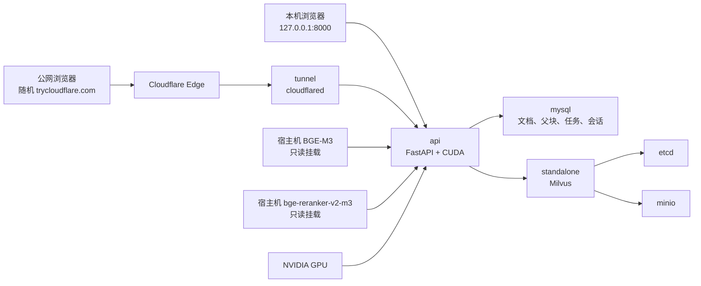
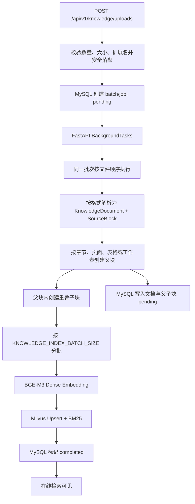
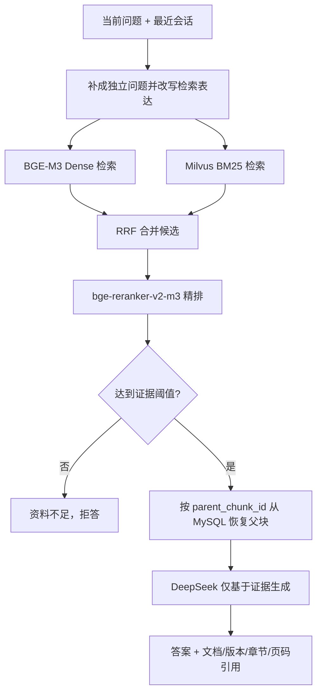

# EvidenceRAG 当前系统架构

> 更新于 2026-09-04。本文只描述当前默认启动的 EvidenceRAG。旧 Text2SQL、经营归因、销量预测和 MCP 代码属于回滚参考，不在在线运行链路中。

## 1. 当前系统边界

EvidenceRAG 是企业文档知识问答系统，负责：

- PDF、DOCX、Markdown、HTML、TXT、Excel 和 JSON 的上传与结构化解析；
- 结构感知父子切块、BGE-M3 向量化和 Milvus BM25；
- Dense + BM25 混合召回、RRF 融合和 `bge-reranker-v2-m3` 精排；
- MySQL 父块恢复、证据门控、DeepSeek 生成和可核验引用；
- 多轮会话、异步运行状态、SSE、轮询回退和用户反馈。

系统不查询旧经营业务表，也不执行 Text2SQL、原因分析、销量预测或 MCP 工具。

## 2. Docker 运行拓扑

| 服务 | 当前职责 | 对宿主机暴露 |
|---|---|---|
| `api` | 页面、API、解析、索引、检索与回答 | `127.0.0.1:8000` |
| `mysql` | 持久化真源、索引状态、会话和反馈 | `127.0.0.1:13306` |
| `standalone` | Dense + BM25 混合检索 | `127.0.0.1:19530` |
| `etcd` | Milvus 元数据协调 | 不直接暴露 |
| `minio` | Milvus 对象存储 | `127.0.0.1:19000/19001` |
| `tunnel` | 临时公网 HTTPS 入口 | 无入站端口 |

API 使用 PyTorch CUDA Runtime 镜像，Compose 通过 `gpus: all` 请求 GPU。两个模型均从宿主机以只读卷挂载，不写入镜像，也不会在容器启动时重新下载。

## 3. 文档上传与索引链路

默认父块目标约 1,600 字符，子块约 400 字符、重叠 80 字符。父块负责保留完整上下文，子块负责检索。Embedding 输入会附加文档标题和章节路径。

当前批量上传是“HTTP 异步、API 进程内顺序执行”，不是 Celery 或独立 Worker：

- 请求会立即返回 `batch_id`，状态通过批次接口查询；
- 同一批次按文件顺序处理，避免 `recreate=true` 被重复执行；
- API 容器停止时，正在执行的进程内任务不能视为可靠的持久队列；
- 该实现适合本机试点和少量文档，不代表大规模生产入库架构。

日常更新应使用 `recreate=false`。同名文档会删除其旧向量并写入新内容；稳定 ID 与文件 SHA-256 用于幂等和审计。

## 4. 在线检索与回答链路

关键设计：

1. Dense 负责语义相似，BM25 负责精确词、缩写和型号。
2. RRF 合并排名，不直接比较两路不可比的原始分数。
3. Reranker 联合编码“问题—候选”，决定最终顺序和证据门槛。
4. 命中子块后恢复父块；同父块在生成前去重。
5. 没有可靠证据时不调用生成模型，避免无依据回答。
6. 异步问答运行和事件写入 MySQL，页面断开后仍可查询结果。

## 5. 数据一致性与故障边界

- MySQL 保存原文、父块、子块元数据和完成状态，是持久化真源。
- Milvus 保存可重建的子块检索索引。
- 文档和父子块先以 `pending` 写入；向量成功后才变为 `completed`。
- 在线父块恢复只读取已完成数据。Milvus 命中但 MySQL 找不到父块时显式报错，不静默生成。
- Compose 的 MySQL、Milvus、etcd 和 MinIO 使用宿主机持久目录；`docker compose stop` 不删除数据。
- `recreate=true` 会重建检索集合，只应用于明确的全量重建，不用于日常增量上传。

## 6. 本地与公网访问

本地访问始终使用：

- 页面：`http://127.0.0.1:8000/`
- OpenAPI：`http://127.0.0.1:8000/docs`
- 就绪检查：`http://127.0.0.1:8000/api/v1/health/ready`

`tunnel` 通过出站连接生成随机 `trycloudflare.com` 地址，不修改路由器端口。地址从 `docker compose logs tunnel` 读取。

当前 Quick Tunnel 边界：

- 地址会在隧道重启后变化；
- 没有 SLA，不作为固定生产域名；
- 当前未增加账号或 API 认证，获得链接的人可以访问全部公开接口；
- Quick Tunnel 不支持 SSE，前端会在事件流失败后自动改用运行结果轮询。

## 7. 运行状态与运维

`/api/v1/health` 只表示 API 进程存活；`/api/v1/health/ready` 才表示 DeepSeek 配置、Milvus、MySQL 和两个本地模型全部可用，并返回当前 `knowledge_chunks`。知识片段数会随上传变化，不应写死在设计文档中。

启动顺序由 Compose 健康依赖控制：

`etcd + minio → Milvus；mysql + Milvus → api；api healthy → tunnel`

停止项目使用 `docker compose stop`；重新启动使用 `docker compose up -d`。临时公网地址重启后需要重新读取并验证。

## 8. 从试点扩展到大批量

当前单机试点优先保证解析质量、切块质量和检索评测。进入大批量阶段时，再实施：

1. Redis/Celery 持久任务队列，将上传与 API 生命周期解耦；
2. 解析、OCR、Embedding 和写入拆成独立 Worker；
3. 文件哈希增量更新与任务断点续跑；
4. BGE-M3 常驻 GPU、跨文档批处理和在线查询优先级；
5. MySQL 批量事务与 Milvus Bulk Import；
6. 蓝绿 Collection 与 Alias 原子切换，避免半成品索引影响查询。

## 9. 质量评估

- 解析层：CER/WER、标题层级 F1、页码与阅读顺序准确率；
- 表格层：单元格、行列结构和合并单元格恢复率；
- 检索层：Recall@K、MRR、nDCG；
- 回答层：Faithfulness、Answer Relevance、Citation Precision/Recall；
- 安全层：知识不足拒答准确率。

当前测试只能证明已覆盖的功能没有回归，不能替代基于真实试点文档的独立盲测。
