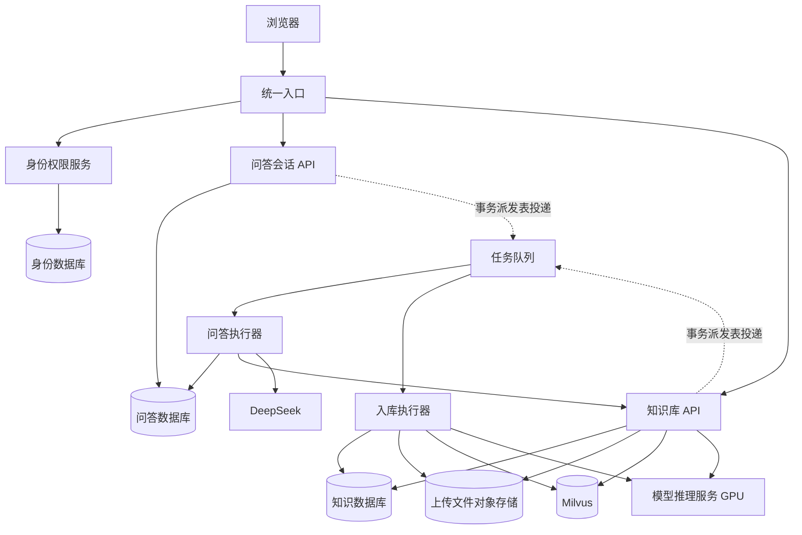

# EvidenceRAG 微服务改造方案

日期：2026-09-07。状态：待评审方案，尚未实施代码、数据库或部署改造。

## 1. 建议与范围

采用渐进式迁移：统一入口 + 四个核心服务（身份权限、问答会话、知识库、模型推理），问答与知识库分别配置独立后台执行器。继续使用 Python、FastAPI、MySQL、Milvus 和 Docker Compose；先解决任务可靠性、GPU 隔离和数据归属，再按容量需要演进部署平台。

本方案默认范围是当前运行的 EvidenceRAG：多格式文档上传、解析切块、混合检索、证据门控、问答生成、会话、权限和管理后台。`LEGACY.md` 明确隔离的 Text2SQL、经营归因、预测和 MCP 不纳入本次拆分。

部署规模、GPU 显存、目标并发、数据量及团队规模尚未确认。以下按现有单机 Compose 环境设计，容量和工期不能视为已经验证的承诺。微服务主要改善独立发布、资源分配和故障隔离；单台服务器、单个 MySQL 和单张 GPU 仍有单点故障，问答速度也不会因拆分自动提升。

## 2. 代码核查结论

| 现状 | 代码依据 | 对改造的影响 |
|---|---|---|
| 页面、认证路由、问答和文档接口集中在同一个 API | `app/main.py` | 逐步保留为统一入口，将业务实现转移到服务 |
| 异步问答、上传索引由进程内 BackgroundTasks 执行 | `app/main.py`、`app/operations/service.py`、`app/runs/service.py` | 任务随 API 生命周期中断，需引入持久任务派发和独立执行器 |
| API 启动预加载 Embedding 和 Reranker | `app/main.py`、`app/rag/service.py`、`Dockerfile` | API 扩容会重复加载模型，应独立 GPU 推理服务 |
| API 启动扫描全部未终态任务并标记失败 | `app/pilot/recovery.py` | 多实例启动会误处理仍在执行的任务，必须先改造恢复逻辑 |
| 限流和部分运行指标保存在进程内 | `app/pilot/rate_limit.py`、`app/pilot/runtime.py` | 多实例需要共享限流计数和汇总指标 |
| 文档、父块、子块状态在 MySQL，检索索引在 Milvus | `app/rag/parent_store.py`、`app/operations/service.py` | 文档与检索保留在同一业务服务，避免跨服务恢复每个父块 |
| 会话、消息和运行创建及完成有本地事务关系 | `app/db/repositories.py`、`app/runs/service.py` | 会话与问答运行放在一个服务，保留原子性 |
| 管理功能直接访问多个领域的数据 | `app/admin/service.py`、`app/pilot/service.py` | 文档删除归知识库；看板聚合领域接口；到期清理由各服务执行 |
| 已有 Cookie 会话、CSRF、角色和资源归属检查 | `app/auth/`、`README.md` | 保留当前认证语义；旧架构文档中“未接入认证”已过时 |
| 工作目录未建立 Git 仓库 | 本地检查、`LEGACY.md` | 实施前建立版本基线，排除密钥、数据库卷、模型和上传文件 |

## 3. 目标服务边界

| 部署单元 | 职责 | 现有代码来源 | 数据归属 |
|---|---|---|---|
| `gateway` | 静态页面、同源入口、认证校验接入、路由、请求 ID、共享限流、管理看板聚合、SSE 代理 | `app/main.py`、`app/static/`、部分 pilot 路由 | 不拥有业务表 |
| `identity-service` | 登录、注册审批、用户管理、会话撤销、角色授权、身份域审计及审计查询聚合 | `app/auth/`、`app/admin/` 的账号部分 | users、auth_sessions、admin_audit_logs |
| `chat-service` + `chat-worker` | 会话、运行、消息、反馈、多轮改写、证据不足拒答、DeepSeek 生成、持久进度事件 | `app/runs/`、`app/rag/workflow.py`、问答与会话相关代码 | conversations、messages、agent_runs、user_feedback；运行事件及任务派发表 |
| `knowledge-service` + `ingestion-worker` | 上传、解析、切块、版本管理、索引、混合检索、重排阈值过滤、父块恢复、删除 | `app/ingestion/`、`app/operations/uploads.py`、索引相关代码、RAG 检索部分 | documents、document_parent_chunks、document_chunks、indexing_jobs；Milvus 集合及上传对象 |
| `inference-service` | BGE-M3 向量化、Reranker 推理、模型预热、批处理和 GPU 并发控制 | `app/rag/embeddings.py`、`reranker.py`、`device.py`、模型运行状态 | 无业务数据库；模型只读挂载 |

这是四个核心服务加一个入口；两个 Worker 是所属服务的执行进程，与各自 API 共用领域代码和数据所有权，独立调节副本数量。

知识服务返回已经校验版本、通过证据阈值并恢复父块的证据包。问答服务用它生成答案和引用，无需直接访问知识库 MySQL 或 Milvus。模型服务只接受推理请求，不访问业务数据库。DeepSeek 调用先留在问答服务，无需再拆一个仅转发模型请求的服务。

同步回答与查询改写接口由问答 API 使用相同领域逻辑处理。图中省略服务身份校验、派发器和审计投递；数据库图示代表逻辑数据归属，可部署在同一 MySQL 实例内。

## 4. 接口兼容与通信

外部优先保留 `/api/v1` 路径、请求和响应字段、HTTP 状态、Cookie、CSRF、SSE 事件格式及轮询回退行为。

| 外部接口范围 | 归属 |
|---|---|
| `/api/v1/auth/*`、`/api/v1/admin/users*`、账号审计查询 | 身份权限服务 |
| `/api/v1/runs*`、`/api/v1/conversations*`、`/api/v1/feedback`、`/api/v1/answers` 及旧 answers 别名 | 问答会话服务 |
| `/api/v1/knowledge/uploads*`、文档列表、索引创建与状态、管理员文档删除 | 知识库服务 |
| `/api/v1/retrieval/search` | 问答服务接收；需要时执行改写，再调用知识库检索 |
| `/api/v1/admin/pilot/*` | 入口聚合各服务的统计、维护预览和执行结果 |

内部采用版本化 HTTP/JSON 接口和连接池，例如知识检索 `/internal/v1/search`、推理 `/internal/v1/embed` 与 `/internal/v1/rerank`。共享代码只包含接口模型、错误码、追踪和服务客户端，不共享 ORM、数据库会话或业务 Repository。

上传处理和问答运行走分开的任务队列；队列消息包含任务 ID、协议版本和追踪 ID，不携带整份文档、Cookie 或数据库连接对象。消费者根据任务 ID 读取所属服务的状态。

明确每段调用及整个请求的超时预算。只对适合重试的请求做有界退避；DeepSeek 调用存在失败后重复计费的可能，业务幂等不等于外部模型只调用一次。不能把依赖故障伪装成“知识不足”：空证据正常拒答，依赖不可用返回可解释的失败。

## 5. 数据边界及迁移

目标是在同一 MySQL 实例内先创建 identity_db、chat_db、knowledge_db，并配置独立账号和迁移目录。只有所属服务及其 Worker 能读写本领域业务表；跨服务数据通过接口或事件获取。

实施初期可在原库按表隔离所有权，作为有期限的过渡状态。移除共享 Repository 和跨域直连后再迁移到独立逻辑库，不能把长期共用所有表作为改造完成状态。

`conversations.user_id` 和 `indexing_jobs.created_by_user_id` 当前引用 users，分库时需改为应用层身份引用，保留原 ID、非空与索引。会话—消息—运行和文档—父块—子块的内部外键继续保留。用户停用和角色变更由身份服务立即撤销登录会话，领域服务不自行修改 users。

迁移按领域短时暂停写入、等待或隔离在途任务、复制数据、核对数量/主键/抽样哈希及关系、切换唯一写入方执行；有未同步新写入时不能直接切回旧库。保留原版本和源数据，回退要先排空新任务并同步增量或恢复一致性备份。现存备份文件不等于已经通过恢复演练。

不再由每个 API 实例启动时并发执行全库迁移；使用受控的一次性迁移任务，服务发布遵循先添加兼容字段、再迁移读写、最后清理旧字段。

## 6. 任务可靠性：第一优先级

首期建议 Celery + Redis，在 Linux 容器内运行 Worker。Redis 队列启用持久化，任务状态和最终结果以 MySQL 为准。限流 Redis 与任务 Redis 宜使用独立实例，分别配置淘汰和持久化策略，避免缓存压力驱逐队列数据。

仅替换 BackgroundTasks 为队列调用还不够，需要一起完成：

1. **原子派发意图**：创建业务任务时，在同一个 MySQL 事务内写入待派发表（Outbox）。派发器发送队列消息并记录投递状态，覆盖“数据库提交成功但发送消息失败”的窗口。
2. **允许重复消息，禁止重复业务提交**：按 task_id、文档版本建立唯一约束和状态条件更新；已完成任务再次收到消息时直接结束。同一 run 只保存一条最终助手消息。
3. **执行权与恢复**：增加执行者、租约截止时间、心跳、尝试次数和递增执行代号。只回收租约过期任务，旧执行器不能覆盖新执行结果。Milvus 等外部写入同时受版本隔离约束，不能仅靠数据库执行权保护。
4. **确认与重试**：任务业务结果提交后确认消息；结合任务丢失处理、最大重试次数和失败隔离，避免坏文档无限重试。Redis 可见性超时与最大任务时长配套；大任务拆成可恢复批次。
5. **恢复投递**：定期扫描已持久化但长期未领取、租约已过期的任务，安全重新派发，覆盖队列数据丢失等场景。
6. **会话串行**：保留当前同一会话最多一个活动 run 的数据库锁定规则；不同会话可以并发。
7. **SSE 重放**：事件按 `(run_id, sequence)` 持久化并保证唯一，支持 Last-Event-ID；实时通知仅作唤醒，断线后能从数据库补齐事件。

Celery 的延迟确认、Worker 丢失处理和幂等需要显式设计，不能假设默认参数已经实现以上语义。参考：[Celery 任务文档](https://docs.celeryq.dev/en/stable/userguide/tasks.html)。Redis 的可见性超时可能导致长任务重投，需要结合实际任务时长配置：[Celery Redis 文档](https://docs.celeryq.dev/en/stable/getting-started/backends-and-brokers/redis.html)。具体依赖版本在实施阶段完成兼容性验证后锁定。

## 7. 文档一致性与 GPU 资源

文档索引改为不可变版本：先保存原文件和新版本父子块，分批生成并写入向量，校验完整后再把新版本设为 active。检索候选进入生成前核查文档当前版本和删除状态，过滤未发布版本；若导致候选不足，应补充召回。旧版本在切换后延迟清理。

全量重建使用新集合和独立索引代号，验证完成后通过一条权威配置切换读流量，查询全程固定同一个索引代号；不要对在线集合直接执行 recreate。若进一步使用 Milvus Alias，须验证切换能力及与 MySQL 元数据的协调过程，不能声称二者有跨系统原子事务。

删除先在知识库真源标记不可见，再幂等清理向量、父子块和文件。返回成功意味着在线已不可检索，物理清理由任务继续保证；若该语义需要改变现有响应，必须通过兼容适配或新版本接口显式表达。管理员审计在业务事务中留下本地可靠记录，再通过 Outbox 汇聚，身份服务故障不能造成已执行操作没有审计依据。

上传文件从本机路径逐步迁移到专用对象桶，用对象键替代 Worker 对宿主机目录的依赖。现有 MinIO 用于 Milvus；即使复用实例，也要给上传文件单独的桶、账号、权限和备份策略，不操作 Milvus 自用数据。对象上传与数据库提交不是一个事务，失败时需要暂存对象清理和补偿。

模型服务独占加载两个本地模型，首期一个 GPU 模型进程。用有界请求队列、入库小批次和在线请求优先调度，限制并发与输入长度；无法中断已经运行的 GPU 批次，因此优先级不能保证零等待。API 和普通 Worker 使用 CPU 镜像，不导入 torch/FlagEmbedding；解析 Worker 单独携带 OCR 和文档解析依赖。压测显存和吞吐后再决定拆分两个模型进程或增加 GPU。

## 8. 身份权限、看板与运行保障

保留服务端会话 Cookie、CSRF、同源检查和账号撤销行为。入口调用身份服务验证会话，内部请求使用可验证的短期身份上下文并认证调用服务；业务服务继续检查角色与资源归属。入口删除外部传入的内部身份头，业务端口不直接暴露公网，不能仅凭裸 user_id 或 role 请求头授权。

初期不缓存授权结果，身份服务不可用时受保护操作明确失败，以保留停用后撤销的语义。后续如缓存需定义撤销传播时间并验收。继续保持当前管理员与员工入口及权限互斥；当前是共享知识库，未来若增加部门/租户范围，应单独设计文档权限模型，不在本次迁移中假定已具备。

管理看板调用各领域统计接口，允许部分统计暂不可用并显示来源和时间。到期清理改为各领域执行并返回分项状态；跨服务不再具有原单库事务的“同时成功或失败”语义，重试必须按维护操作 ID 幂等。

统一 request_id、run_id、job_id 和分布式追踪；监测队列等待、处理耗时、失败率、GPU 显存、检索延迟和 SSE 重连。分服务区分存活与就绪，知识库为空不应让登录或上传服务被判定不可启动。首期 Compose 实现服务内网发现、独立健康检查和重启策略；镜像按服务锁定版本。达到多机调度或高可用需求时再评估 Kubernetes。

## 9. 分阶段实施与出口条件

| 阶段 | 工作 | 完成条件 |
|---|---|---|
| 0. 基线 | 建立版本控制与备份恢复流程；保存 API 契约；梳理有效 tests_rag 测试；记录真实文档问答和性能基线 | 原系统行为可复现，备份可恢复，权限和关键链路有验收样本 |
| 1. 可靠任务 | 引入队列、Outbox、两类 Worker、租约与幂等；移除启动全量失败逻辑；分布式限流 | API 重启不丢任务；启动第二实例不干扰在途任务；重投不重复提交 |
| 2. 推理隔离 | 将 Embedding/Reranker 抽为模型服务，拆 CPU/GPU 镜像和配置 | API 扩容不复制 GPU 模型；上传与在线问答混合压测无显存失控 |
| 3. 领域拆分 | 按知识库、问答会话、身份权限顺序迁移；统一入口做路由；迁移文档删除、审计和看板 | 通过服务接口交互，只有所属服务读写业务表，旧路径可用 |
| 4. 数据与发布 | 分逻辑库和账号；迁移对象存储；落实版本化索引、独立迁移和发布回退 | 服务具备独立构建/发布/回退能力，跨库直连被权限和检查阻止 |
| 5. 验收切换 | 契约测试、端到端测试、故障注入、性能对照；按领域切换写入和流量 | 质量不低于基线，故障可恢复，回退演练完成 |

每阶段建立可部署检查点。阶段 1、2 优先带来可靠性和资源隔离收益；只有完成领域所有权及独立发布后，才视为完整的微服务改造。

建议目录结构：`services/gateway`、`services/identity`、`services/chat`、`services/knowledge`、`services/inference`；各领域有自己的 API、领域逻辑、数据访问、迁移和测试。`packages/contracts` 存协议，`packages/observability` 存追踪工具，`deploy/` 存 Compose 和部署配置，`tests/contract` 与 `tests/e2e` 验证边界。问答和入库 Worker 分别属于 chat 与 knowledge。

## 10. 验收清单

- 当前注册审批、登录/退出、首次改密、员工和管理员角色、CSRF、跨用户访问拦截全部保持。
- 上传、状态查询、检索、答案引用、多轮会话、反馈、文档删除、看板和维护功能通过现有有效测试及端到端验收。
- API 重启、多实例滚动启动、Worker 中途退出、消息重复投递、提交后确认前崩溃，均不造成重复助手消息、错误终态或永久卡住。
- MySQL 已提交但队列不可用时，任务可在恢复后重新派发；Redis 重启、短暂网络中断和队列丢失恢复有演练记录。
- SSE 断线重连能补齐有序事件，轮询可取得同一最终结果；多副本不依赖粘性会话。
- 文档更新/删除/重建期间不向新请求暴露半成品或已删除证据；旧执行器不能重新激活被删除或淘汰的版本。
- 混合上传与查询负载下，对比 P95 接口延迟、问答总时长、排队时长、入库吞吐和峰值显存；阈值根据阶段 0 的数据量和机器基线确认，不提前编造数值。
- 对固定文档与问题集评测检索结果、证据门控和引用正确性；模型生成文本不要求逐字相同。
- 任一服务升级或模型服务暂不可用时，故障范围和界面提示符合设计；登录、管理和已完成任务查询不因 GPU 预热被整体阻断。
- 新部署完成数据核对和恢复/回退演练，确认可在保留新写入的前提下回退。

本轮验证为代码、配置和文档的静态核查，并查阅队列官方文档；未运行服务、测试、压测或数据迁移。没有据此宣称当前系统已经具备分布式运行能力。
