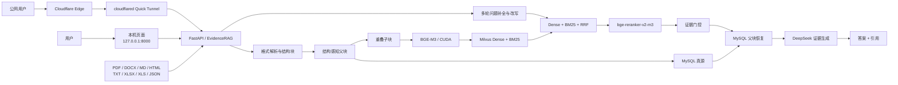
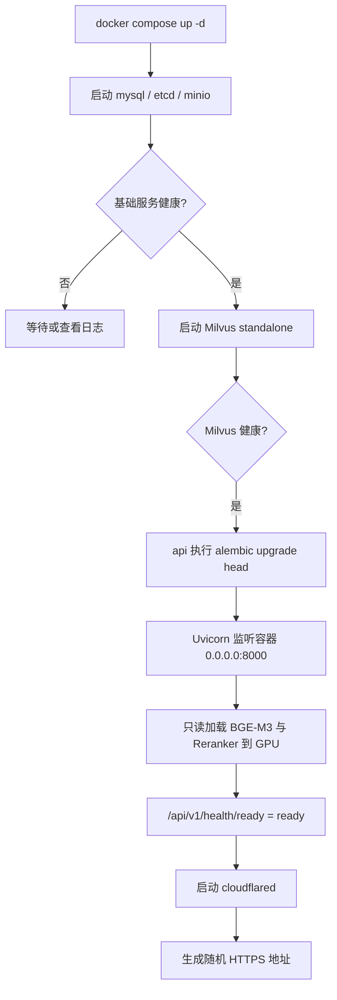
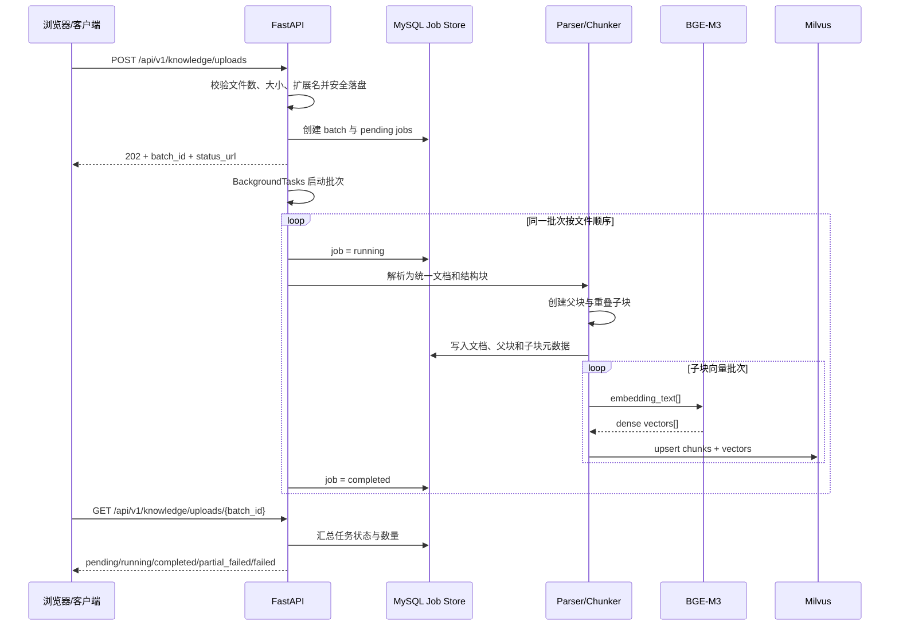
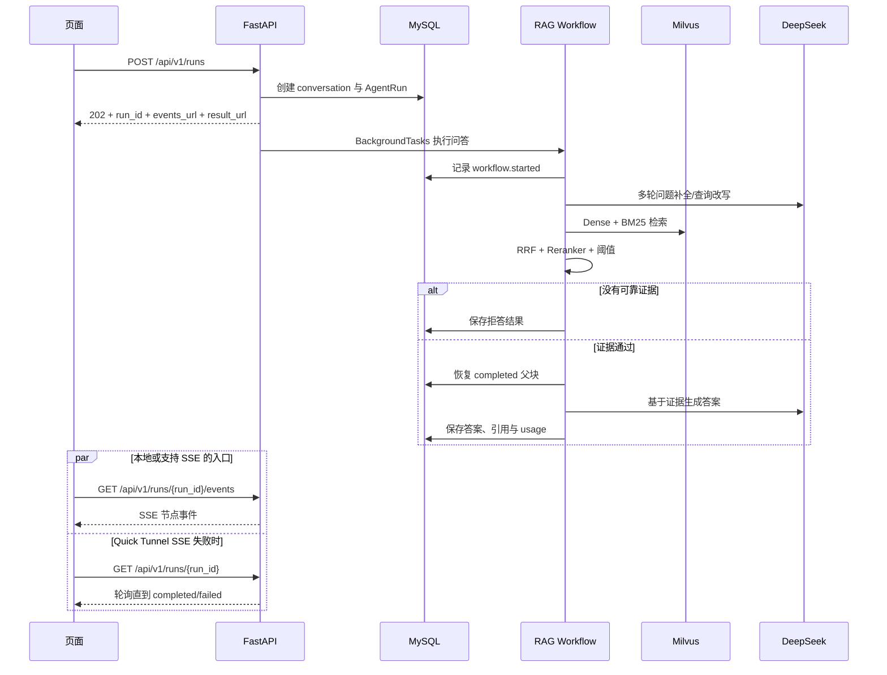
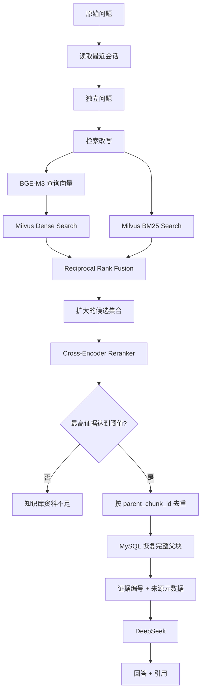
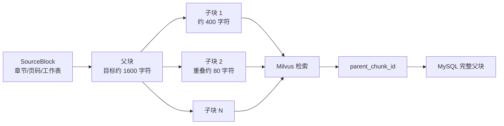
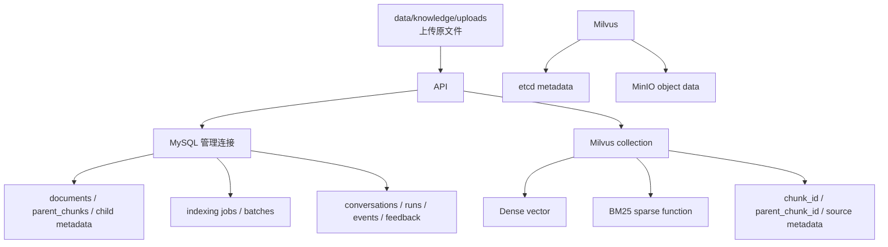
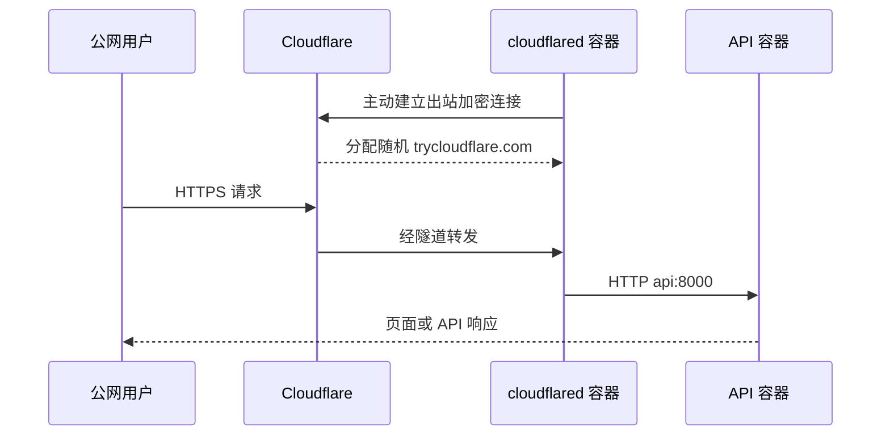

# EvidenceRAG 当前完整链路图

> 更新于 2026-09-04。本文覆盖当前实际运行的 Web/API、文档索引、混合检索、问答、数据存储、Docker GPU 和临时公网链路。旧 Text2SQL、归因、预测和 MCP 不在默认运行时中，详见 `LEGACY.md`。

## 1. 全局端到端总览

## 2. Docker 启动链路

宿主机端口只绑定到 `127.0.0.1`。公网访问通过 `tunnel` 容器到 Docker 网络中的 `api:8000`，不直接开放宿主机入站端口。

## 3. 上传与索引时序

当前“异步”指请求无需等待整个索引完成，但实际任务仍运行在 API 进程内。同一批次顺序执行，适用于本机试点，不等同于持久化分布式任务队列。

## 4. 异步问答时序

## 5. 混合检索详细链路

检索分数和重排分数含义不同：RRF 分数用于融合排名，不是概率；最终证据顺序和门槛主要由 Reranker 决定。

## 6. 父子切块链路

父块优先遵循标题、PDF 页面、表格和 Excel 工作表边界；子块不跨父块。检索使用小块提高召回，生成使用父块保持上下文完整。

## 7. 数据与状态关系

MySQL 是可审计真源，Milvus 是可重建索引。只有 MySQL 与向量写入完成的文档才进入在线父块恢复。

## 8. 公网链路

当前临时公网入口不带账号密码。它用于演示，不是固定域名方案；重启后地址变化，异常时容器可能仍为 `Up`，但应以公网 HTTP 验证和 tunnel 日志为准。

## 9. 失败与恢复边界

| 场景 | 当前行为 |
|---|---|
| 文件类型或大小不合法 | 创建后台任务前拒绝 |
| 单个索引任务失败 | MySQL 标记 `failed`，批次可为 `partial_failed` |
| API 在入库中停止 | 进程内 BackgroundTask 中断，需要重新提交或补偿 |
| Milvus 有命中但父块缺失 | 显式检索故障，不静默生成 |
| 证据低于阈值 | 返回知识不足，不调用最终生成 |
| SSE 中断 | 页面改为轮询运行结果 |
| Tunnel 断线 | 本地服务继续可用；公网需重连并获取新地址 |
| `docker compose stop` | 停止服务但保留镜像、模型和持久数据 |

## 10. 当前代码锚点

| 能力 | 主要位置 |
|---|---|
| FastAPI 页面、健康、问答与上传 API | `app/main.py` |
| 上传批次与索引执行 | `app/operations/service.py` |
| 文档解析器 | `app/ingestion/` |
| 父子切块 | `app/rag/documents.py` |
| BGE-M3 | `app/rag/embeddings.py` |
| Milvus 混合检索 | `app/rag/milvus_store.py` |
| Reranker 与问答服务 | `app/rag/reranker.py`、`app/rag/service.py` |
| MySQL 模型与仓储 | `app/db/` |
| 页面 SSE 与轮询回退 | `app/static/app.js` |
| Docker GPU、模型挂载与隧道 | `Dockerfile`、`docker-compose.yml` |

## 11. 当前边界与下一阶段

- 当前入库批次顺序执行，适合少量试点文档；
- OCR 仅在配置开启且 PDF 缺少文本时使用；
- Quick Tunnel 无认证、非固定地址且无生产可用性保证；
- 没有租户隔离、文档级权限过滤或独立任务队列；
- 大批量阶段应增加 Celery/Redis Worker、增量指纹、断点续跑、GPU 批处理、Milvus Bulk Import 和蓝绿 Collection。

## 12. 一句话总结

`多格式文档 → 结构解析 → 父子切块 → BGE-M3 → Milvus Dense/BM25 → RRF → bge-reranker-v2-m3 → 证据门控 → MySQL 父块 → DeepSeek → 带引用回答`。
